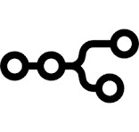
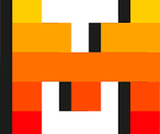

# 💫 Hi Everyone

 <h2>My job is to make your life easier with Blockchain.</h2>

# 💻 My Skills:

<table align="center">
    <tr>
        <td align="center" width="150">
            
             Solidity
        </td>
        <td align="center" width="150">
            
             Rust
        </td>
        <td align="center" width="150">
            
             Go
        </td> 
        <td align="center" width="150">
            
             Cosmos
        </td>
        <td align="center" width="150">
            
             Ethereum
        </td>    
        <td align="center" width="150">
            
             Solana
        </td>
        <td align="center" width="150">
            
             Polygon
        </td>               
    </tr>
    <tr>
        <td align="center" width="150">
            
             Ton
        </td> 
        <td align="center" width="150">
            
             Polkadot
        </td>
        <td align="center" width="150">
            
             Aptos
        </td>  
        <td align="center" width="150">
            
             Near
        </td> 
        <td align="center" width="150">
            
             Sui
        </td>
        <td align="center" width="150">
            
             Stellar
        </td>
        <td align="center" width="150">
            
             Hardhat
        </td>        
    </tr>
    <tr>
        <td align="center" width="150">
            
             React
        </td> 
        <td align="center" width="150">
            
             Node.js
        </td> 
         <td align="center" width="150">
            
             Next.js
        </td>
        <td align="center" width="150">
            
             Vue
        </td>
        <td align="center" width="150">
            
             Python
        </td>
         <td align="center" width="150">
            
             Hedera 
        </td>
        <td align="center" width="150">
            
             XRP
        </td>
    </tr>
    <tr>
        <td align="center" width="150">
            
             AI
        </td> 
        <td align="center" width="150">
            
             GPT
        </td> 
         <td align="center" width="150">
            
             N8N
        </td>
        <td align="center" width="150">
            
             Mistral
        </td>
        <td align="center" width="150">
            
             Zapier
        </td>
         <td align="center" width="150">
            
             Gemini 
        </td>
        <td align="center" width="150">
            
             Flash
        </td>
    </tr>
</table>
  

